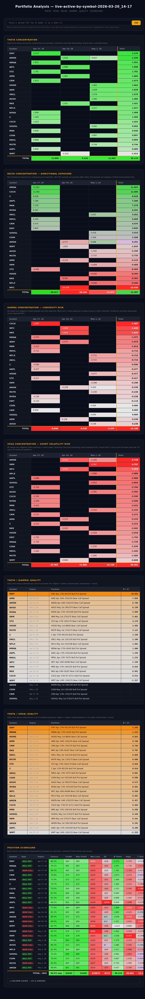

# OptionSpread Heatmaps

Greek concentration heatmaps and portfolio analysis for options credit spreads, powered by [OptionStrat](https://optionstrat.com) exports.



## Quick start

```bash
npm ci               # enforces lock file — see Security note below
cp .env.example .env # add your OptionStrat credentials
./run.sh             # download → convert → analyse → reports/
```

## Scripts

| Script | Input | Output |
|---|---|---|
| `run.sh` | — | Full pipeline: download, convert, portfolio |
| `publish.sh` | — | `run.sh`, then upload to S3, regenerate the index and invalidate CloudFront |
| `download.js` | — | `data/*.csv` (downloads Group: Live from OptionStrat, converts xlsx → csv) |
| `portfolio.js <csv>` | CSV file | `reports/*-portfolio.html`, `reports/*-portfolio.json` |
| `whatif.js` | — | Embedded in every HTML report (client-side what-if logic) |

After each run, `reports/index.html` is fully regenerated listing all current reports.

## Directory layout

```
data/       source CSVs (downloaded by download.js, gitignored)
reports/    generated HTML reports, JSON snapshots, and index.html (gitignored)
docker/     Dockerfile, compose file, crontab and env template for scheduled publishing
```

## Automated download

`download.js` logs in to OptionStrat via its API, exports the Saved Trades (Group: Live) as xlsx, converts it to CSV, and deletes the xlsx. Credentials are read from `.env`:

```
OPTIONSTRAT_EMAIL=you@example.com
OPTIONSTRAT_PASSWORD=yourpassword
OPTIONSTRAT_ACCOUNT_ID=your-account-uuid
```

The account ID is the UUID for your "Live" group on OptionStrat.

The session cookie is persisted to `.session.json` after the first successful login. Subsequent runs reuse the session and skip the login flow as long as the session remains valid. The file is gitignored.

### Security note

`npm ci` is intentional: it treats `package-lock.json` as authoritative and fails if anything drifts, preventing a compromised upstream package version from silently entering the build. Never use `npm install` on this project.

## Scheduled publishing (Docker)

The `docker/` directory runs `publish.sh` on a schedule in a container, publishing to https://spreads.billbaran.us.

| File | Purpose |
|---|---|
| `docker/Dockerfile` | Node 24 Alpine image with the AWS CLI and [supercronic](https://github.com/aptible/supercronic) |
| `docker/compose.yaml` | Runs the container; `data/` and `reports/` live in named volumes |
| `docker/crontab` | Schedule: 7:45 AM and 1:25 PM Mountain, weekdays |
| `docker/.env.example` | Template for `docker/.env` (OptionStrat + AWS credentials) |

The container runs with `TZ=America/Denver`, so the crontab is in local time and DST is handled automatically. Output goes to `docker compose logs`. Because the volumes persist between runs, `daily-pnl.js` has previous snapshots to compare against.

```bash
cp docker/.env.example docker/.env      # fill in credentials
docker compose -f docker/compose.yaml up -d --build
docker compose -f docker/compose.yaml exec optionspread /app/publish.sh   # publish now
docker compose -f docker/compose.yaml logs -f
```

The AWS credentials belong to the `optionspread-heatmaps-billbaran-docker-publish` IAM user defined in `cloudformation.yaml`. It has the same permissions as the GitHub deploy role. Its access key is created outside the stack, so the secret never appears in stack outputs:

```bash
aws iam create-access-key --user-name optionspread-heatmaps-billbaran-docker-publish
```

To deploy to a remote Docker host, point the same commands at it. The image is built on the remote host, and `docker/.env` is read locally:

```bash
docker -H ssh://core@192.168.50.207 compose -f docker/compose.yaml up -d --build
```

The GitHub **Update Portfolio** workflow is kept for manual runs only. GitHub-scheduled runs were routinely delayed by 3–4 hours.

## Manual export from OptionStrat

1. Open your positions on [OptionStrat](https://optionstrat.com)
2. Saved Trades → Group: Live → Export → Export as .xlsx (Excel)
3. Convert the xlsx to CSV and pass it to `index.js` or `portfolio.js`

Individual option legs and non-spread positions are filtered out automatically. Only spreads are included.

## What-if modeling

Every generated HTML report contains a **What-if** panel at the top. Paste a spread row from the OptionStrat CSV export (or copy directly from Excel — tab-separated format is also accepted) and click **Add**. The row is inserted into every table in the correct sorted position and highlighted with a colored border. A pill appears at the top for each added spread; click its **×** to remove that spread from all tables. Multiple spreads can be modeled simultaneously. All totals update automatically when rows are added or removed.

This lets you see exactly how a prospective trade would change your greek concentrations, quality rankings, and scorecard before entering the position.

## Portfolio analysis — `portfolio.js`

**Theta Concentration**
Daily time decay by underlying × expiration. Green = more theta collected. Rows sorted by theta total descending. Grand total = how much the whole book earns per day from time decay.

**Vega Concentration**
Short-volatility risk by underlying × expiration. All values are negative (credit spreads are short premium = short vega). More red = more exposure to a volatility spike. Rows sorted by vega total ascending (most exposed first). Grand total = approximate dollar loss across the book per 1% rise in IV.

**Delta Concentration**
Net directional exposure by underlying × expiration. Bull Put spreads contribute positive delta, Bear Call spreads contribute negative delta. Diverging color scale (green = positive, red = negative). Rows sorted by delta total descending (most positive first).

**Gamma Concentration**
Convexity risk by underlying × expiration. All values are negative (credit spreads are short gamma). More red = more exposure to large moves in either direction. Rows sorted by gamma total ascending (most exposed first).

**Theta / |Gamma| Quality**
Each spread ranked by daily theta earned per unit of gamma risk. Higher is better — the position is well-compensated for its convexity exposure. Useful for identifying positions to close to free up capital. Positions with gamma = 0 are listed at the bottom.

**Theta / |Vega| Quality**
Each spread ranked by daily theta earned per unit of vega exposure. Higher is better — the position is well-compensated for its volatility risk. Low values identify the first candidates to close into a volatility spike. Complements Theta/|Gamma|: gamma risk is acute and move-driven; vega risk is broader and regime-driven.

**Position Scorecard**
All metrics side-by-side in one table, each column independently color-normalized. Grouped by expiration, sorted by theta within each group.

| Column | Description |
|---|---|
| Chance | Platform's probability of max profit (both legs expire worthless) |
| Credit | Net premium collected |
| Max Profit | Maximum possible gain |
| Max Loss | Maximum possible loss |
| EV | `Chance × MaxProfit − (1−Chance) × MaxLoss` — binary-outcome expected value. Negative EV is typical since max loss >> max profit; use it as a relative comparison across positions, not an absolute signal. |
| Θ Theta | Daily time decay (positive = earns with each passing day) |
| Vega | Sensitivity to implied volatility (negative = hurt by IV spikes) |
| Γ Gamma | Convexity (negative for credit spreads — large moves in either direction hurt) |
| IV | Implied volatility at entry |
| Θ/\|Γ\| | Quality ratio: theta per unit of gamma risk |
| Θ/\|V\| | Quality ratio: theta per unit of vega exposure |
| Return | Current return on the position |

An expandable column guide at the bottom of the scorecard explains EV and all columns to its right in detail.

**JSON snapshot**
`portfolio.js` also writes `reports/*-portfolio.json` — a machine-readable version of the scorecard. Each file is timestamped and contains all position metrics with ISO-formatted expiration dates. Intended for downstream use: periodic risk checks, alerts on low-quality positions, and trend graphs across snapshots over time.

## Requirements

Node.js 22.9+ (for `--env-file-if-exists`). Dependencies: `xlsx` (SheetJS, xlsx → csv conversion). No browser or Playwright needed — downloads use the OptionStrat API directly.
