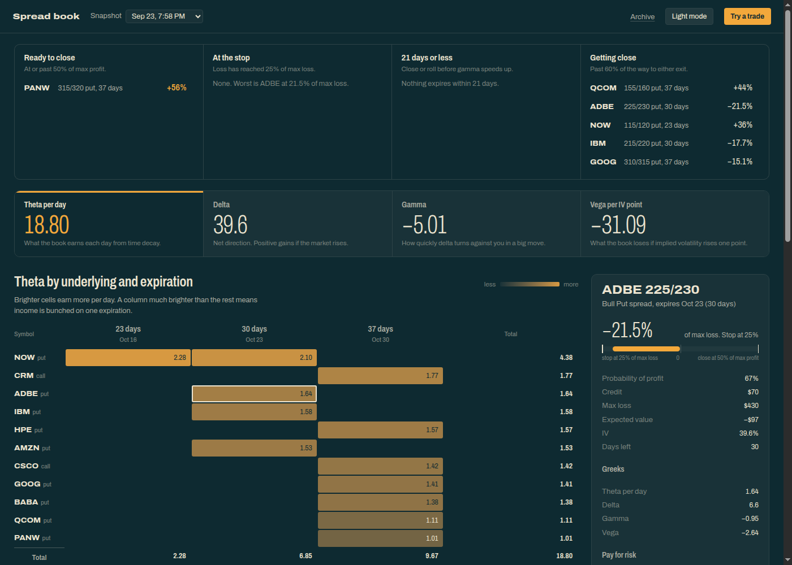
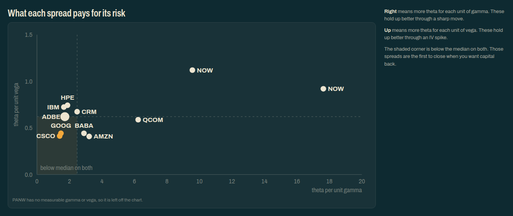
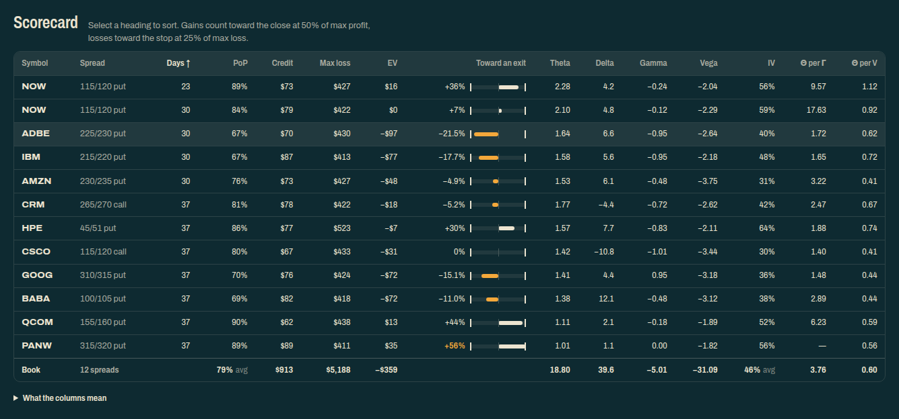

# OptionSpread Heatmaps

Greek concentration heatmaps and portfolio analysis for options credit spreads, powered by [OptionStrat](https://optionstrat.com) exports.



## Quick start

```bash
npm ci               # enforces lock file — see Security note below
cp .env.example .env # add your OptionStrat credentials
./run.sh             # download → convert → analyse → reports/
```

## Scripts

| Script | Input | Output |
|---|---|---|
| `run.sh` | — | Full pipeline: download, convert, portfolio |
| `publish.sh` | — | `run.sh`, then upload to S3, regenerate the index and invalidate CloudFront |
| `download.js` | — | `data/*.csv` (downloads Group: Live from OptionStrat, converts xlsx → csv) |
| `portfolio.js <csv>` | CSV file | `reports/*-portfolio.html`, `reports/*-portfolio.json` |
| `report.js`, `report.css`, `theme.css`, `palette.js` | — | Inlined into every portfolio report; the page is drawn in the browser from the embedded snapshot |
| `generate-index.js` | file list | `reports/index.html` (copy of the latest report), `reports/archive.html`, `reports/snapshots.json` |
| `whatif.js` | — | Embedded in the legacy heatmaps report from `index.js` |

After each run, `reports/index.html` is replaced with the latest report, and `reports/snapshots.json` lists the 14 newest snapshots (about a week at two runs per trading day) for the report's Snapshot menu.

## Directory layout

```
data/       source CSVs (downloaded by download.js, gitignored)
reports/    generated HTML reports, JSON snapshots, and index.html (gitignored)
docker/     Dockerfile, compose file, crontab and env template for scheduled publishing
```

## Automated download

`download.js` logs in to OptionStrat via its API, exports the Saved Trades (Group: Live) as xlsx, converts it to CSV, and deletes the xlsx. Credentials are read from `.env`:

```
OPTIONSTRAT_EMAIL=you@example.com
OPTIONSTRAT_PASSWORD=yourpassword
OPTIONSTRAT_ACCOUNT_ID=your-account-uuid
```

The account ID is the UUID for your "Live" group on OptionStrat.

The session cookie is persisted to `.session.json` after the first successful login. Subsequent runs reuse the session and skip the login flow as long as the session remains valid. The file is gitignored.

### Security note

`npm ci` is intentional: it treats `package-lock.json` as authoritative and fails if anything drifts, preventing a compromised upstream package version from silently entering the build. Never use `npm install` on this project.

## Scheduled publishing (Docker)

The `docker/` directory runs `publish.sh` on a schedule in a container, publishing to https://spreads.billbaran.us.

| File | Purpose |
|---|---|
| `docker/Dockerfile` | Node 24 Alpine image with the AWS CLI and [supercronic](https://github.com/aptible/supercronic) |
| `docker/compose.yaml` | Runs the container; `data/` and `reports/` live in named volumes |
| `docker/crontab` | Schedule: 7:45 AM and 1:25 PM Mountain, weekdays |
| `docker/.env.example` | Template for `docker/.env` (OptionStrat + AWS credentials) |

The container runs with `TZ=America/Denver`, so the crontab is in local time and DST is handled automatically. Output goes to `docker compose logs`. Because the volumes persist between runs, `daily-pnl.js` has previous snapshots to compare against.

```bash
cp docker/.env.example docker/.env      # fill in credentials
docker compose -f docker/compose.yaml up -d --build
docker compose -f docker/compose.yaml exec optionspread /app/publish.sh   # publish now
docker compose -f docker/compose.yaml logs -f
```

The AWS credentials belong to the `optionspread-heatmaps-billbaran-docker-publish` IAM user defined in `cloudformation.yaml`. It has the same permissions as the GitHub deploy role. Its access key is created outside the stack, so the secret never appears in stack outputs:

```bash
aws iam create-access-key --user-name optionspread-heatmaps-billbaran-docker-publish
```

To deploy to a remote Docker host, point the same commands at it. The image is built on the remote host, and `docker/.env` is read locally:

```bash
docker -H ssh://core@192.168.50.207 compose -f docker/compose.yaml up -d --build
```

The container is the only publisher. The old GitHub Actions workflow was removed because GitHub-scheduled runs were routinely delayed by 3–4 hours.

## Manual export from OptionStrat

1. Open your positions on [OptionStrat](https://optionstrat.com)
2. Saved Trades → Group: Live → Export → Export as .xlsx (Excel)
3. Convert the xlsx to CSV and pass it to `index.js` or `portfolio.js`

Individual option legs and non-spread positions are filtered out automatically. Only spreads are included.

## The report — `portfolio.js`

Each report is one self-contained HTML page. It embeds its snapshot as JSON and `report.js` draws it in the browser. Colours come from the same three-colour palette engine as equity-watch (`palette.js`): pick a palette with the swatch in the lower left, and switch light or dark mode in the header. Both choices are remembered per browser.

**Snapshot menu.** Lists the 14 newest snapshots from `snapshots.json`. Choosing one loads its `*-portfolio.json` and redraws the page in place, so older snapshots use the current design too. The choice is kept in the URL (`?snapshot=<base>`), so it can be linked. Opened from disk, the menu shows only the report itself.

**Decisions.** Four lists at the top of the page, before any analysis:
- *Ready to close*: at or past 50% of max profit.
- *At the stop*: the loss has reached 25% of max loss.
- *21 days or less*: inside the close-or-roll window.
- *Getting close*: more than 60% of the way to either exit.

**Book totals.** Theta per day, delta, gamma and vega per IV point for the whole book. Each total is also the switch for the heatmap directly below (keys 1–4 do the same).

**Heatmap.** The chosen greek by underlying and expiration, with row and column totals. Each underlying gets one row per spread type, so the two legs of an iron condor stay separate. Delta uses a diverging scale: signal colour for bullish, ink for bearish.

**Spread detail.** Click any cell, chart dot, decision or scorecard row to open that spread: progress from the stop to the close target, PoP, credit, max loss, EV, IV, the greeks, and its rank on both quality ratios. Iron condor legs link to each other.

**What each spread pays for its risk.** Theta per unit gamma against theta per unit vega. Spreads below the median on both fall in the shaded corner. Those are the first to close when you want capital back. Spreads with zero gamma or vega are listed under the chart instead.

The dashed lines are the book's medians, not the chart's midpoint, so a line sits off-centre when a few spreads are far above the rest.



**Scorecard.** Every spread with days left, PoP, credit, max loss, EV, progress toward an exit, the greeks, IV and both quality ratios, plus book totals. Select a heading to sort. A column guide below the table explains each one. For progress toward an exit, a gain is a share of max profit and a loss is a share of max loss, matching the two exit rules.



**Try a trade.** Paste one or more rows from the OptionStrat export, comma-separated or copied from Excel. Each trade is added to every total, the heatmap, the chart and the scorecard with a dashed outline, and the totals show how much it changes. Remove a trade with its × chip. Rows that aren't spreads stay in the box with a note.

**JSON snapshot**
`portfolio.js` also writes `reports/*-portfolio.json`. Each file is timestamped and contains all position metrics with ISO-formatted expiration dates. The report page reads these for its Snapshot menu, and `daily-pnl.js` compares them.

## Requirements

Node.js 22.9+ (for `--env-file-if-exists`). Dependencies: `xlsx` (SheetJS, xlsx → csv conversion). No browser or Playwright needed — downloads use the OptionStrat API directly.
